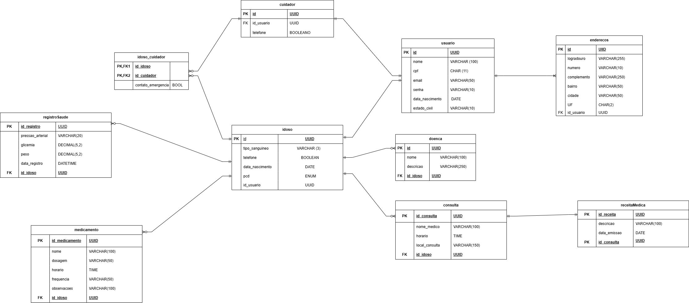
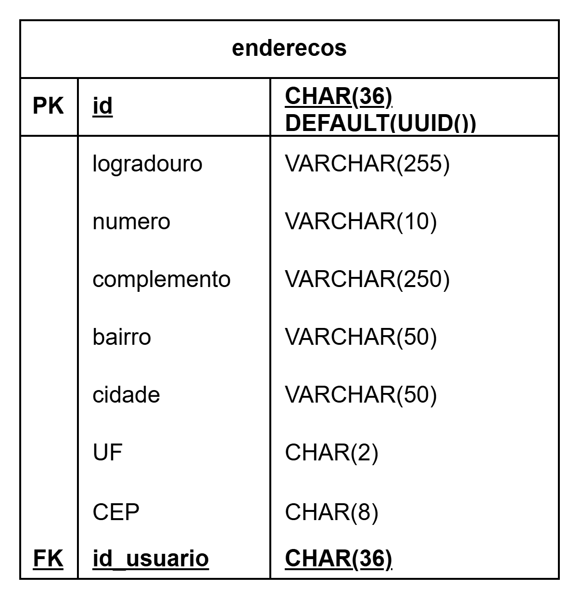
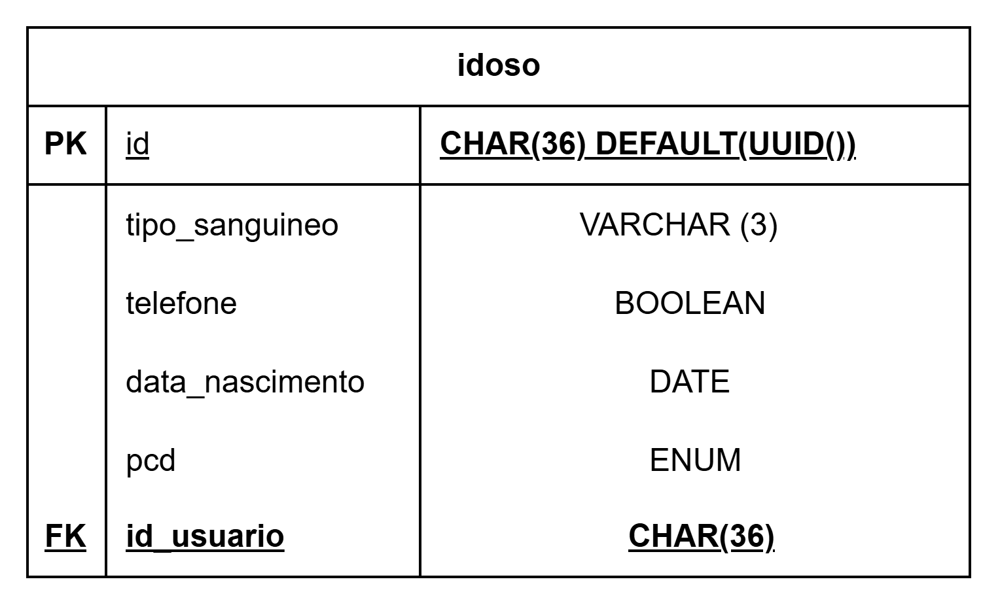
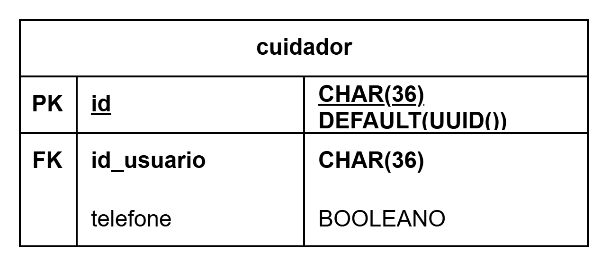
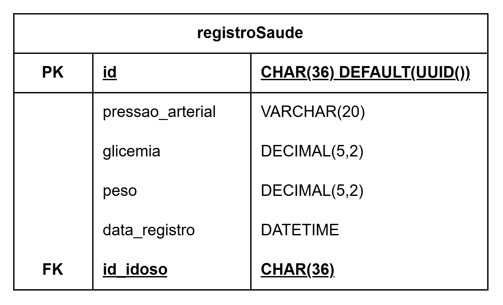
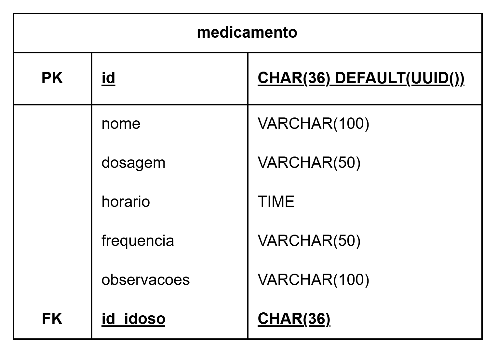
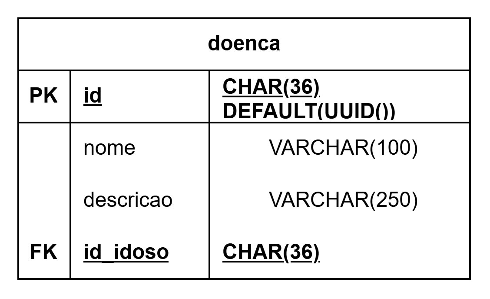
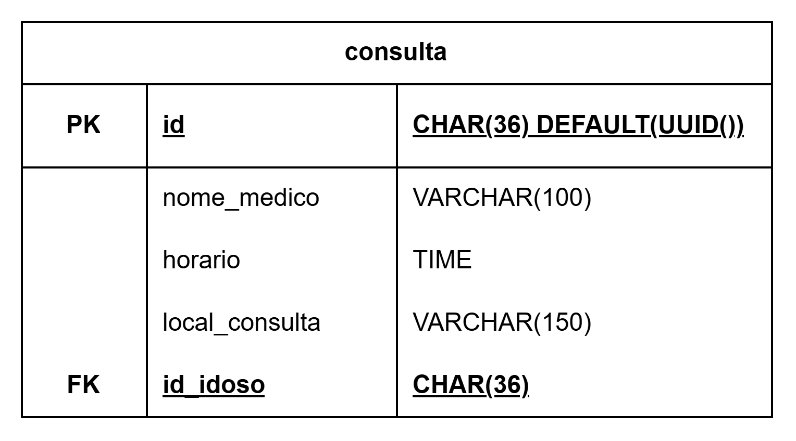
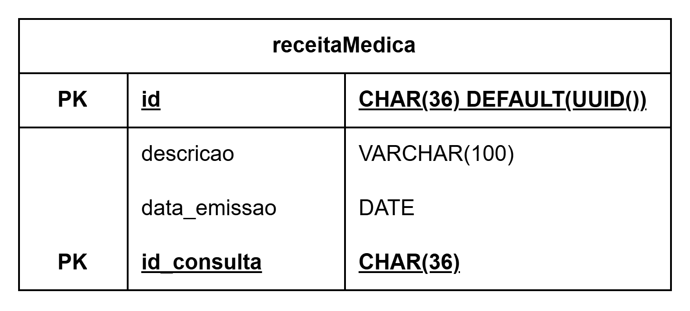

# 🗄️ Banco de Dados - Dia a Dia Vovôs

Este documento detalha a modelagem de dados utilizada para garantir a persistência segura das informações de saúde, rotina e usuários do sistema.

# 📊 Modelo Entidade-Relacionamento (DER)

A estrutura foi desenhada para suportar perfis distintos (Idosos, Cuidadores, Administradores) e o monitoramento contínuo de dados vitais.

---

# 🧩 Estrutura das Tabelas

## 👥Diagrama de Entidade e Relacionamento

## 👤 Núcleo de Usuários

* **`usuario`**: Tabela central contendo `nome`, `cpf`, `email`, `senha` e `data_nascimento`.

* **`enderecos`**: Armazena a localização dos usuários, vinculada pelo `id_usuario`.

* **`idoso`**: Atributos específicos como `tipo_sanguineo`, `pcd` e `telefone`.

* **`cuidador`**: Identifica usuários com permissões de gestão de saúde.

* **`idoso_cuidador`**: Tabela associativa que vincula obrigatoriamente um idoso a um cuidador.

## 👤 Entidades

* **`usuario`**: Tabela central contendo as informações de um usuário geral. Se relaciona com as entidades Idoso (um para um), Cuidador (um para um) e Endereco (um para muitos);

* **`enderecos`**: Armazena a localização dos usuários. Se relaciona com a entidade Usuario (muitos para um);

* **`idoso`**: Identifica usuários que se enquadram como idoso. Se relaciona com as entidades Usuario (um para um), registroSaude (um para muitos opicional), medicamento (um para muitos opicional), doenca (um para muitos opicional), consulta (um para muitos opicional), idoso_cuidador (um para muitos opicional);

* **`cuidador`**: Identifica usuários que se enquadram como cuidador, responsável pela gestão de saúde dos usuários idosos vinculados à ele. Se relaciona com as entidades Usuario (um para um), idoso_cuidador (um para muitos opicional);

* **`idosoCuidador`**: Tabela associativa que vincula um idoso a um cuidador e para isso precisa obrigatoriamente de um usário de cada tipo. Se relaciona com Cuidador (muitos opicional para um), Idoso (muitos opicional para um);

* **`registroSaude`**: Armazena os dados da saúde do idoso, esses sendo `pressao_arterial`, `glicemia`, `peso`, além do vínculo com o `id_idoso`. Se relaciona com Idoso (muitos opicional para um);

* **`medicamentos`**: Registra os medicamentos que o idoso consome, inclui `nome`, `dosagem`, `horario`, `frequencia`, `observacoes`, além do vínculo com o `id_idoso`. Se relaciona com Idoso (muitos opicional para um);

* **`doenca`**: Registra as doenças que o idoso possui, contendo `nome`, `descricao`, além do vínculo com `id_idoso`. Se relaciona com Idoso (muitos opicional para um);

* **`consulta`**: Registra as informações de uma consulta médica que o idoso compareceu ou comparecerá, contendo `nome_medico`, `horario`, `local_consulta`, alpem do vínculo com `id_idoso`. Se relaciona com Idoso (muitos opicional para um);

* **`receitaMedica`**: Armazena as informações que foram passadas em uma consulta, contendo `descricao` e `data_emissao`. Se relaciona com Consulta (um para um);

## 🏥 Gestão de Saúde e Rotina

* **`medicamento`**: Registro de `nome`, `dosagem`, `horario` e `frequencia` para controle do idoso.

* **`registroSaude`**: Histórico de sinais vitais como `pressao_arterial`, `glicemia`, `batimento_cardiaco`, `temperatura` e `peso`.

* **`doenca`**: Cadastro de patologias e descrições do histórico médico do idoso.

* **`consulta`**: Agendamento de compromissos com `nome_medico`, `horario` e `local_consulta`.

* **`receitaMedica`**: Armazena descrições e datas de emissão vinculadas às consultas médicas em `descricao` e em `data_emissao`.

---

# 🛠️ Tecnologias e Regras

* **SGBD**: MySQL.

* **Integridade**:
* O preenchimento de `tipo_sanguineo`, `contato_emergencia` e `doenca` é obrigatório no primeiro acesso (RN-005).

* Relacionamentos via UUID para garantir a segurança e unicidade dos registros de saúde.

* **Segurança (LGPD)**: Todos os dados sensíveis são armazenados seguindo os protocolos de conformidade da Lei Geral de Proteção de Dados (RNF-005).

---

**FHAMN & SENAI** | Modelagem de Dados | Sumaré, 2026.