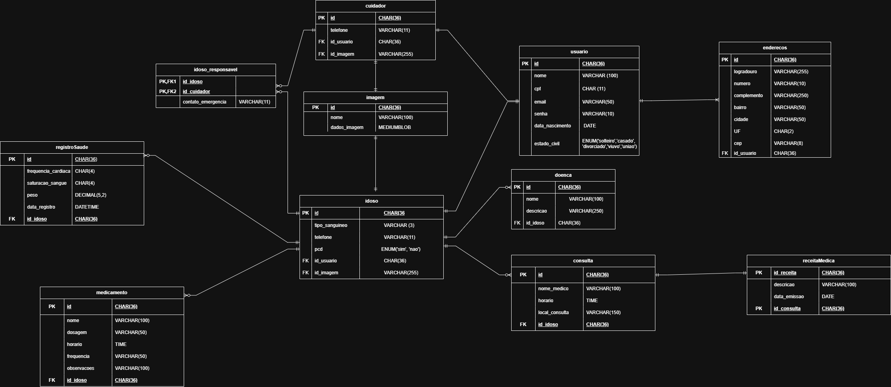
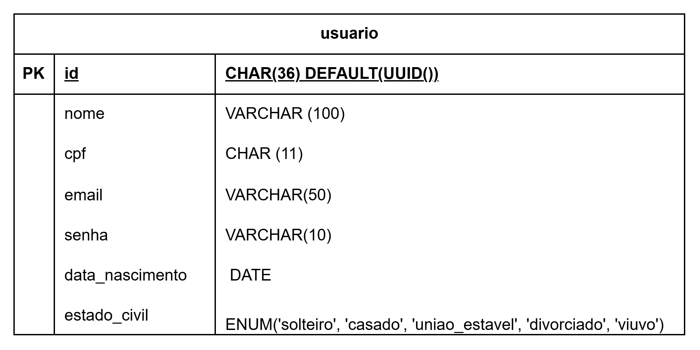
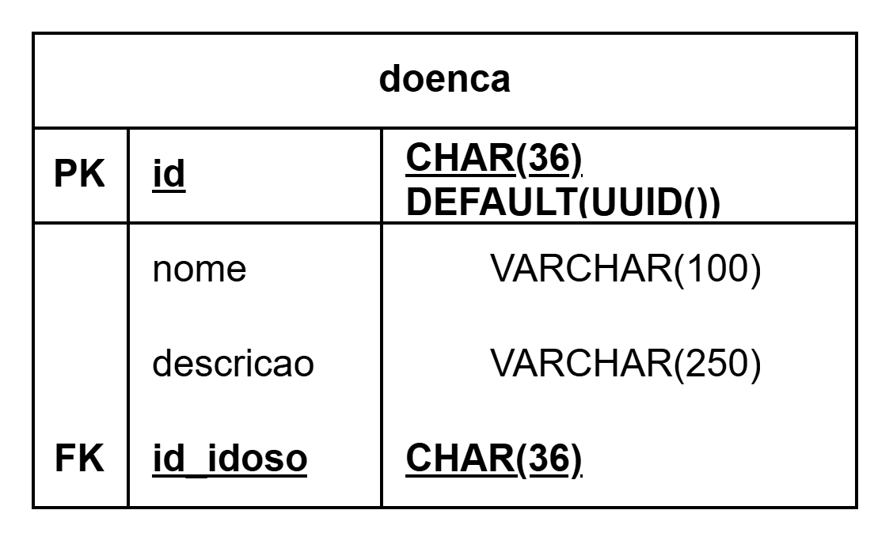
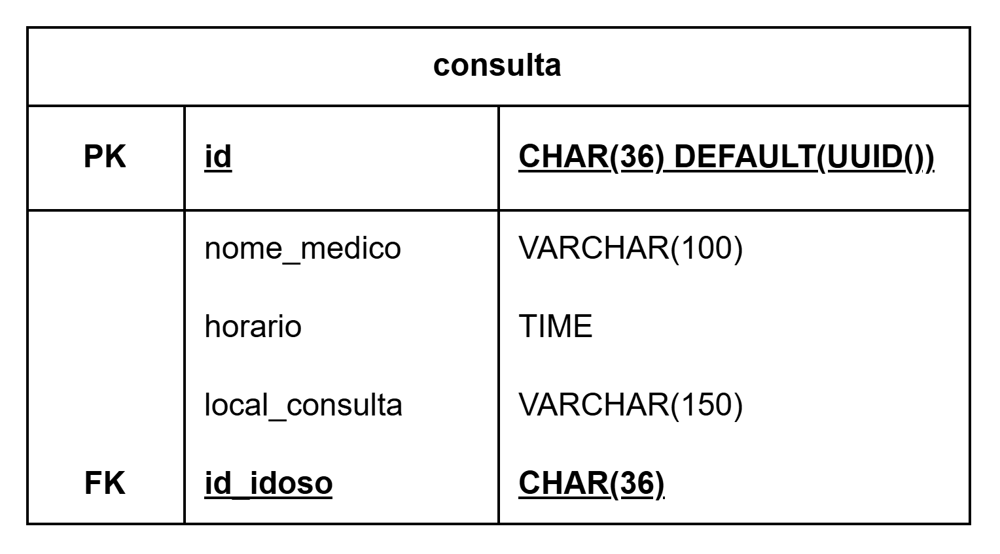
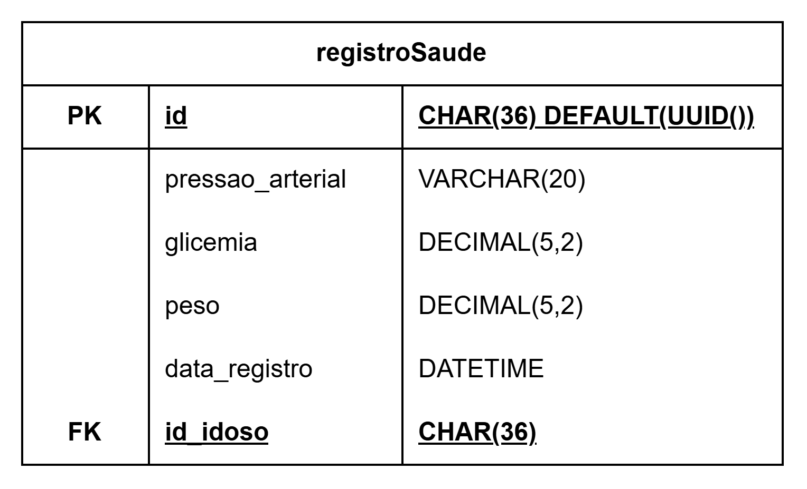
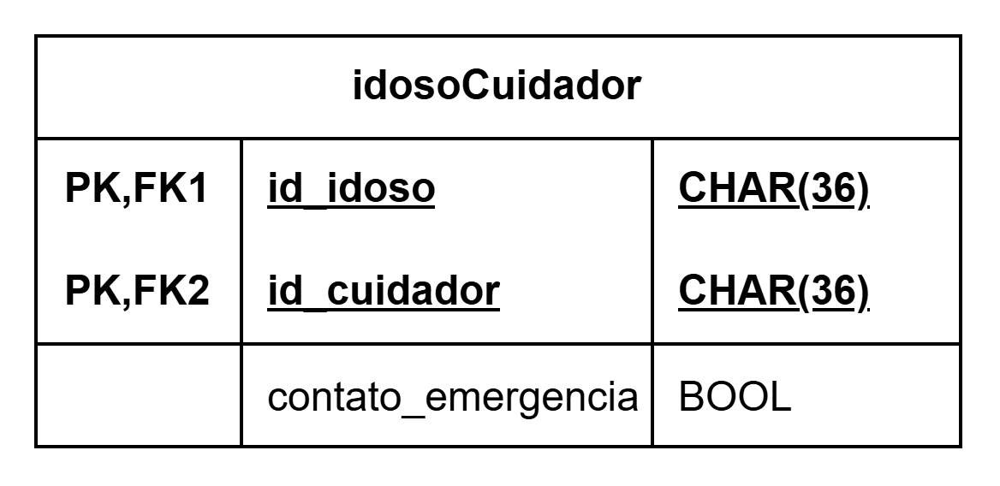

# 🗄️ Banco de Dados - Dia a Dia Vovôs

Este documento detalha a modelagem de dados utilizada para garantir a persistência segura das informações de saúde, rotina e usuários do sistema.

# 📊 Modelo Entidade-Relacionamento (DER)

A estrutura foi desenhada para suportar perfis distintos (Idosos, Cuidadores, Administradores) e o monitoramento contínuo de dados vitais.

---

# 🧩 Estrutura das Tabelas

## 👥Diagrama de Entidade e Relacionamento

## 👤 Núcleo de Usuários

* **`usuario`**: Tabela central contendo `nome`, `cpf`, `email`, `senha` e `data_nascimento`.

* **`enderecos`**: Armazena a localização dos usuários, vinculada pelo `id_usuario`.

* **`idoso`**: Atributos específicos como `tipo_sanguineo`, `pcd` e `telefone`.

* **`cuidador`**: Identifica usuários com permissões de gestão de saúde.

* **`idoso_cuidador`**: Tabela associativa que vincula obrigatoriamente um idoso a um cuidador.

## 👤 Entidades

* **`usuario`**: Tabela central contendo as informações de um usuário geral. Se relaciona com as entidades Idoso (um para um), Cuidador (um para um) e Endereco (um para muitos);

* **`enderecos`**: Armazena a localização dos usuários. Se relaciona com a entidade Usuario (muitos para um);

* **`idoso`**: Identifica usuários que se enquadram como idoso. Se relaciona com as entidades Usuario (um para um), registroSaude (um para muitos opicional), medicamento (um para muitos opicional), doenca (um para muitos opicional), consulta (um para muitos opicional), idoso_cuidador (um para muitos opicional);

* **`cuidador`**: Identifica usuários que se enquadram como cuidador, responsável pela gestão de saúde dos usuários idosos vinculados à ele. Se relaciona com as entidades Usuario (um para um), idoso_cuidador (um para muitos opicional);

# 🗄️ Modelo de Dados — Dia a Dia Vovôs

Este documento apresenta o modelo de dados do sistema Dia a Dia Vovôs, com foco nas entidades, seus atributos e relacionamentos.

## 📊 Diagrama Entidade-Relacionamento (DER)

# 📦 Entidades

## 👤 Entidade: Usuário (`usuario`)

### 📌 Descrição
Representa os usuários gerais do sistema e armazena suas informações pessoais e de acesso.

### 🧾 Atributos
- `id` (PK)
- `nome`
- `cpf` (UNIQUE)
- `email` (UNIQUE)
- `senha`
- `vinculo_imagem`
- `data_nascimento`
- `estado_civil`

## 👤 Entidade: Idoso (`idoso`)

### 📌 Descrição
Representa o perfil de idoso vinculado a um usuário e armazena informações específicas desse perfil.

### 🧾 Atributos
- `id` (PK)
- `tipo_sanguineo`
- `telefone`
- `data_nascimento`
- `pcd`
- `id_usuario` (FK)

## 👤 Entidade: Cuidador (`cuidador`)

### 📌 Descrição
Representa o perfil de cuidador associado a um usuário do sistema.

### 🧾 Atributos
- `id` (PK)
- `telefone`
- `id_usuario` (FK)

## 🏠 Entidade: Endereços (`enderecos`)

### 📌 Descrição
Armazena os endereços dos usuários cadastrados no sistema.

### 🧾 Atributos
- `id` (PK)
- `logradouro`
- `numero`
- `complemento`
- `bairro`
- `cidade`
- `UF`
- `id_usuario` (FK)

## 🩺 Entidade: Doença (`doenca`)

### 📌 Descrição
Registra as doenças relacionadas ao perfil de um idoso.

### 🧾 Atributos
- `id` (PK)
- `nome`
- `descricao`
- `id_idoso` (FK)

## 📅 Entidade: Consulta (`consulta`)

### 📌 Descrição
Armazena informações sobre consultas médicas realizadas ou agendadas pelo idoso.

### 🧾 Atributos
- `id` (PK)
- `nome_medico`
- `horario`
- `local_consulta`
- `id_idoso` (FK)

## 🧾 Entidade: Receita Médica (`receitamedica`)

### 📌 Descrição
Armazena informações sobre receitas médicas relacionadas às consultas.

### 🧾 Atributos
- `id` (PK)
- `descricao`
- `data_emissao`
- `id_consulta` (FK)

## 💊 Entidade: Medicamento (`medicamento`)

### 📌 Descrição
Registra os medicamentos utilizados pelo idoso, incluindo informações para o controle da rotina.

### 🧾 Atributos
- `id` (PK)
- `nome`
- `dosagem`
- `horario`
- `frequencia`
- `observacoes`
- `id_idoso` (FK)

## ❤️ Entidade: Registro de Saúde (`registroSaude`)

### 📌 Descrição
Armazena informações e medições relacionadas à saúde do idoso.

### 🧾 Atributos
- `id` (PK)
- `pressao_arterial`
- `glicemia`
- `peso`
- `data_registro`
- `id_idoso` (FK)

## 🔗 Entidade Associativa: Idoso e Cuidador (`idoso_cuidador`)

### 📌 Descrição
Relaciona os idosos aos cuidadores responsáveis pelo acompanhamento e pela gestão de suas informações.

### 🧾 Atributos
- `id_idoso` (PK, FK)
- `id_cuidador` (PK, FK)
- `contato_emergencia`

## 🛡️ Entidade: Administrador (`admin`)

### 📌 Descrição
Armazena as informações de identificação e acesso dos administradores do sistema.

### 🧾 Atributos
- `id` (PK)
- `nome`
- `email`
- `senha`
- `criado_em`

## 🖼️ Entidade: Imagem (`imagem`)

### 📌 Descrição
Armazena informações e os dados binários de imagens.

### 🧾 Atributos
- `id` (PK)
- `nome`
- `dados_imagem`

## ✉️ Entidade: Solicitação de Cuidador (`solicitacao_cuidador`)

### 📌 Descrição
Armazena as solicitações de vínculo entre idosos e cuidadores, incluindo o status, a data de expiração e o contato de emergência.

### 🧾 Atributos
- `id` (PK)
- `id_idoso`
- `id_cuidador`
- `status`
- `expira_em`
- `contato_emergencia`

# 🔗 Relacionamentos

## Relacionamento: Usuário × Idoso

### 📌 Descrição
Relaciona um usuário ao seu perfil de idoso.

### 🧾 Estrutura
- `idoso.id_usuario` (FK → `usuario.id`)
- Cardinalidade: Usuário 1:N Idoso, conforme as restrições definidas no SQL.

## Relacionamento: Usuário × Cuidador

### 📌 Descrição
Relaciona um usuário ao seu perfil de cuidador.

### 🧾 Estrutura
- `cuidador.id_usuario` (FK → `usuario.id`)
- Cardinalidade: Usuário 1:N Cuidador, conforme as restrições definidas no SQL.

## Relacionamento: Usuário × Endereços

### 📌 Descrição
Um usuário pode possuir vários endereços cadastrados.

### 🧾 Estrutura
- `enderecos.id_usuario` (FK → `usuario.id`)
- Cardinalidade: Usuário 1:N Endereços.

## Relacionamento: Idoso × Doenças

### 📌 Descrição
Um idoso pode possuir várias doenças cadastradas.

### 🧾 Estrutura
- `doenca.id_idoso` (FK → `idoso.id`)
- Cardinalidade: Idoso 1:N Doenças.

## Relacionamento: Idoso × Consultas

### 📌 Descrição
Um idoso pode possuir várias consultas médicas cadastradas.

### 🧾 Estrutura
- `consulta.id_idoso` (FK → `idoso.id`)
- Cardinalidade: Idoso 1:N Consultas.

## Relacionamento: Consulta × Receita Médica

### 📌 Descrição
Relaciona as receitas médicas às consultas correspondentes.

### 🧾 Estrutura
- `receitamedica.id_consulta` (FK → `consulta.id`)
- Cardinalidade: Consulta 1:N Receitas, conforme o SQL, pois `id_consulta` não possui restrição UNIQUE.

## Relacionamento: Idoso × Medicamentos

### 📌 Descrição
Um idoso pode possuir vários medicamentos cadastrados para controle da rotina.

### 🧾 Estrutura
- `medicamento.id_idoso` (FK → `idoso.id`)
- Cardinalidade: Idoso 1:N Medicamentos.

## Relacionamento: Idoso × Registros de Saúde

### 📌 Descrição
Um idoso pode possuir vários registros de saúde ao longo do tempo.

### 🧾 Estrutura
- `registroSaude.id_idoso` (FK → `idoso.id`)
- Cardinalidade: Idoso 1:N Registros de Saúde.

## Relacionamento: Idoso × Cuidador

### 📌 Descrição
A tabela associativa permite que idosos sejam vinculados a cuidadores, estabelecendo uma relação de muitos para muitos.

### 🧾 Estrutura (`idoso_cuidador`)
- `id_idoso` (PK, FK → `idoso.id`)
- `id_cuidador` (PK, FK → `cuidador.id`)
- `contato_emergencia`

### 📐 Cardinalidade
- Idoso 1:N Vínculos.
- Cuidador 1:N Vínculos.
- Idoso N:N Cuidador, por meio da tabela associativa.

# ⚙️ Tecnologias e Regras

## Banco de Dados

- **SGBD:** MySQL.
- Os identificadores das tabelas são do tipo `CHAR(36)`.
- As tabelas que possuem UUID padrão utilizam `UUID()` para gerar identificadores automaticamente.

## Integridade dos Dados

- As chaves estrangeiras garantem a integridade dos relacionamentos entre as tabelas.
- Os relacionamentos definidos com `ON DELETE CASCADE` permitem a exclusão dos registros dependentes quando o registro referenciado é excluído.
- A tabela `idoso_cuidador` utiliza uma chave primária composta por `id_idoso` e `id_cuidador`.

## Observações do Esquema

- A tabela `solicitacao_cuidador` possui os campos `id_idoso` e `id_cuidador`, mas eles não foram definidos como chaves estrangeiras no SQL fornecido.
- A tabela `admin` não possui relacionamentos com outras tabelas no SQL fornecido.
- A tabela `imagem` não possui chave estrangeira definida. O campo `usuario.vinculo_imagem` não está declarado como FK para `imagem.id`.
- Os campos `batimento_cardiaco` e `temperatura` estavam na documentação anterior, mas não aparecem na definição SQL fornecida para `registroSaude`.

## Segurança e LGPD

Os dados pessoais e sensíveis armazenados pelo sistema devem ser tratados conforme os requisitos da Lei Geral de Proteção de Dados (LGPD), relacionados à RNF-005.

---

**FHAMN & SENAI** | Modelagem de Dados | Sumaré, 2026.

* **`idosoCuidador`**: Tabela associativa que vincula um idoso a um cuidador e para isso precisa obrigatoriamente de um usário de cada tipo. Se relaciona com Cuidador (muitos opicional para um), Idoso (muitos opicional para um);

* **`registroSaude`**: Armazena os dados da saúde do idoso, esses sendo `pressao_arterial`, `glicemia`, `peso`, além do vínculo com o `id_idoso`. Se relaciona com Idoso (muitos opicional para um);

* **`medicamentos`**: Registra os medicamentos que o idoso consome, inclui `nome`, `dosagem`, `horario`, `frequencia`, `observacoes`, além do vínculo com o `id_idoso`. Se relaciona com Idoso (muitos opicional para um);

* **`doenca`**: Registra as doenças que o idoso possui, contendo `nome`, `descricao`, além do vínculo com `id_idoso`. Se relaciona com Idoso (muitos opicional para um);

* **`consulta`**: Registra as informações de uma consulta médica que o idoso compareceu ou comparecerá, contendo `nome_medico`, `horario`, `local_consulta`, alpem do vínculo com `id_idoso`. Se relaciona com Idoso (muitos opicional para um);

* **`receitaMedica`**: Armazena as informações que foram passadas em uma consulta, contendo `descricao` e `data_emissao`. Se relaciona com Consulta (um para um);

## 🏥 Gestão de Saúde e Rotina

* **`medicamento`**: Registro de `nome`, `dosagem`, `horario` e `frequencia` para controle do idoso.

* **`registroSaude`**: Histórico de sinais vitais como `pressao_arterial`, `glicemia`, `batimento_cardiaco`, `temperatura` e `peso`.

* **`doenca`**: Cadastro de patologias e descrições do histórico médico do idoso.

* **`consulta`**: Agendamento de compromissos com `nome_medico`, `horario` e `local_consulta`.

* **`receitaMedica`**: Armazena descrições e datas de emissão vinculadas às consultas médicas em `descricao` e em `data_emissao`.

---

# 🛠️ Tecnologias e Regras

* **SGBD**: MySQL.

* **Integridade**:
* O preenchimento de `tipo_sanguineo`, `contato_emergencia` e `doenca` é obrigatório no primeiro acesso (RN-005).

* Relacionamentos via UUID para garantir a segurança e unicidade dos registros de saúde.

* **Segurança (LGPD)**: Todos os dados sensíveis são armazenados seguindo os protocolos de conformidade da Lei Geral de Proteção de Dados (RNF-005).

---

**FHAMN & SENAI** | Modelagem de Dados | Sumaré, 2026.