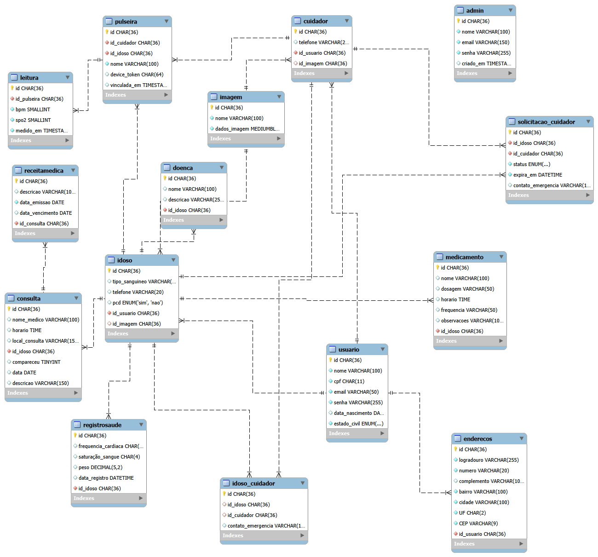

# 🗄️ Modelo de Dados — Dia a Dia Vovôs

Este documento apresenta o modelo de dados do sistema Dia a Dia Vovôs, com foco nas entidades, seus atributos e relacionamentos.

# 📊 Diagrama Entidade-Relacionamento (DER)

A estrutura foi desenhada para suportar perfis distintos (idosos e cuidadores) e o acompanhamento da saúde e da rotina dos idosos.

# 📦 Entidades

## 👤 Entidade: Usuário (`usuario`)

### 📌 Descrição
Tabela central com as informações de um usuário geral do sistema. Relaciona-se com Idoso (1:1), Cuidador (1:1) e Endereços (1:N).

### 🧾 Atributos
- `id` (PK) — CHAR(36)
- `nome` — VARCHAR(100)
- `cpf` (UNIQUE) — CHAR(11)
- `email` (UNIQUE) — VARCHAR(50)
- `senha` — VARCHAR(255)
- `data_nascimento` — DATE
- `estado_civil` — ENUM

## 🏠 Entidade: Endereços (`enderecos`)

### 📌 Descrição
Armazena a localização dos usuários. Relaciona-se com Usuário (N:1).

### 🧾 Atributos
- `id` (PK) — CHAR(36)
- `logradouro` — VARCHAR(255)
- `numero` — VARCHAR(20)
- `complemento` — VARCHAR(100)
- `bairro` — VARCHAR(100)
- `cidade` — VARCHAR(100)
- `UF` — CHAR(2)
- `CEP` — VARCHAR(9)
- `id_usuario` (FK) — CHAR(36)

## 👵 Entidade: Idoso (`idoso`)

### 📌 Descrição
Identifica os usuários que se enquadram como idoso. Relaciona-se com Usuário (1:1) e, de forma opcional, com Registro de Saúde, Medicamento, Doença, Consulta e Idoso/Cuidador (1:N).

### 🧾 Atributos
- `id` (PK) — CHAR(36)
- `tipo_sanguineo` — VARCHAR
- `telefone` — VARCHAR(20)
- `pcd` — ENUM('sim', 'nao')
- `id_usuario` (FK) — CHAR(36)
- `id_imagem` (FK, opcional) — CHAR(36)

## 🧑‍⚕️ Entidade: Cuidador (`cuidador`)

### 📌 Descrição
Identifica os usuários que se enquadram como cuidador, responsáveis pela gestão de saúde dos idosos vinculados a eles. Relaciona-se com Usuário (1:1) e, de forma opcional, com Idoso/Cuidador (1:N).

### 🧾 Atributos
- `id` (PK) — CHAR(36)
- `telefone` — VARCHAR
- `id_usuario` (FK) — CHAR(36)
- `id_imagem` (FK, opcional) — CHAR(36)

## 🔗 Entidade Associativa: Idoso e Cuidador (`idoso_cuidador`)

### 📌 Descrição
Vincula um idoso a um cuidador e, para isso, exige um usuário de cada tipo. Relaciona-se com Idoso (N:1) e Cuidador (N:1).

### 🧾 Atributos
- `id` (PK) — CHAR(36)
- `id_idoso` (FK) — CHAR(36)
- `id_cuidador` (FK) — CHAR(36)
- `contato_emergencia` — VARCHAR

## ❤️ Entidade: Registro de Saúde (`registrosaude`)

### 📌 Descrição
Armazena os dados de saúde do idoso. Relaciona-se com Idoso (N:1).

### 🧾 Atributos
- `id` (PK) — CHAR(36)
- `frequencia_cardiaca` — CHAR
- `saturacao_sangue` — CHAR(4)
- `peso` — DECIMAL(5,2)
- `data_registro` — DATETIME
- `id_idoso` (FK) — CHAR(36)

## 💊 Entidade: Medicamento (`medicamento`)

### 📌 Descrição
Registra os medicamentos que o idoso utiliza, para o controle da rotina. Relaciona-se com Idoso (N:1).

### 🧾 Atributos
- `id` (PK) — CHAR(36)
- `nome` — VARCHAR(100)
- `dosagem` — VARCHAR(50)
- `horario` — TIME
- `frequencia` — VARCHAR(50)
- `observacoes` — VARCHAR
- `id_idoso` (FK) — CHAR(36)

## 🩺 Entidade: Doença (`doenca`)

### 📌 Descrição
Registra as doenças que o idoso possui. Relaciona-se com Idoso (N:1).

### 🧾 Atributos
- `id` (PK) — CHAR(36)
- `nome` — VARCHAR(100)
- `descricao` — VARCHAR(255)
- `id_idoso` (FK) — CHAR(36)

## 📅 Entidade: Consulta (`consulta`)

### 📌 Descrição
Registra as informações de uma consulta médica que o idoso compareceu ou comparecerá. Relaciona-se com Idoso (N:1).

### 🧾 Atributos
- `id` (PK) — CHAR(36)
- `nome_medico` — VARCHAR(100)
- `horario` — TIME
- `local_consulta` — VARCHAR(150)
- `id_idoso` (FK) — CHAR(36)
- `compareceu` — TINYINT
- `data` — DATE
- `descricao` — VARCHAR(150)

## 🧾 Entidade: Receita Médica (`receitamedica`)

### 📌 Descrição
Armazena as informações passadas em uma consulta. Relaciona-se com Consulta (N:1).

### 🧾 Atributos
- `id` (PK) — CHAR(36)
- `descricao` — VARCHAR
- `data_emissao` — DATE
- `data_vencimento` — DATE
- `id_consulta` (FK) — CHAR(36)

# 🔗 Relacionamentos

| Relacionamento | Chave estrangeira | Cardinalidade |
|---|---|---|
| Usuário × Idoso | `idoso.id_usuario` → `usuario.id` | 1:1 |
| Usuário × Cuidador | `cuidador.id_usuario` → `usuario.id` | 1:1 |
| Usuário × Endereços | `enderecos.id_usuario` → `usuario.id` | 1:N |
| Idoso × Cuidador | `idoso_cuidador.id_idoso` e `idoso_cuidador.id_cuidador` | N:N (tabela associativa) |
| Idoso × Registro de Saúde | `registrosaude.id_idoso` → `idoso.id` | 1:N |
| Idoso × Medicamento | `medicamento.id_idoso` → `idoso.id` | 1:N |
| Idoso × Doença | `doenca.id_idoso` → `idoso.id` | 1:N |
| Idoso × Consulta | `consulta.id_idoso` → `idoso.id` | 1:N |
| Consulta × Receita Médica | `receitamedica.id_consulta` → `consulta.id` | 1:N |

# 🛠️ Tecnologias e Regras

- **SGBD:** MySQL.
- **Identificadores:** as tabelas usam UUID (`CHAR(36)`) para garantir a segurança e a unicidade dos registros.
- **Integridade:** as chaves estrangeiras garantem a consistência dos relacionamentos. O preenchimento de `tipo_sanguineo`, `contato_emergencia` e `doenca` é obrigatório no primeiro acesso (RN-005).
- **Segurança (LGPD):** os dados sensíveis são armazenados conforme a Lei Geral de Proteção de Dados (RNF-005).

---

**FHAMN & SENAI** | Modelagem de Dados | Sumaré, 2026.